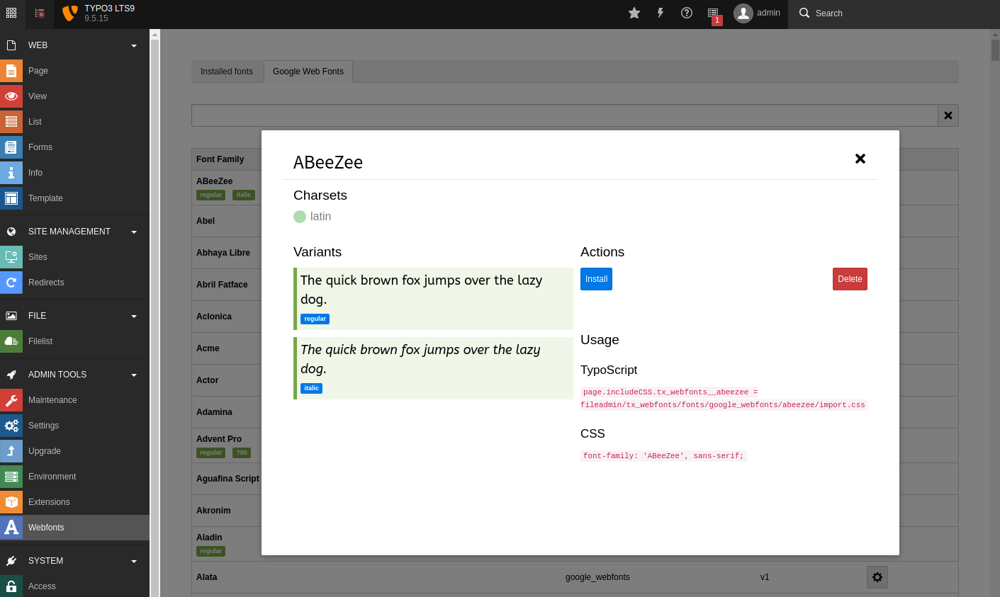

.. every .rst file should include Includes.txt
.. use correct path!

.. include:: Includes.txt

.. Every manual should have a start label for cross-referencing to
.. start page. Do not remove this!

.. _start:

.. MATCH EM_CONF

=============================================================
Download webfonts for self-hosting
=============================================================

:Extension:
   webfonts

:Version:
   |release|

:Language:
   en

:Authors:
   Thomas Pronold | zotorn.de

:Email:
   tp@zotorn.de

:Website:
   https://zotorn.de

:License:
   This extension documentation is published under the GPL-2.0-or-later license

:Keywords:
   webfonts, fonts, selfhosted, selfhosting, self-hosting, self-hosted, google webfonts, google fonts, zotornit, zotorn

.. MATCH EM_CONF

Easy way to use self-hosted webfonts on your website.

Currently only Google Webfonts is supported. The extension is build in a way that more webfont providers can be added in the future.

What does it do?
================

Downloads webfonts for self-hosting.

Currently supported webfont providers
--------------------------------------

* `Google Fonts <https://fonts.google.com/>`__ via `google-webfonts-helper <https://google-webfonts-helper.herokuapp.com/fonts>`__ API

.. toctree::
   :maxdepth: 3
   :hidden:

   Installation/Index
   HowTo/Index
   Sitemap

